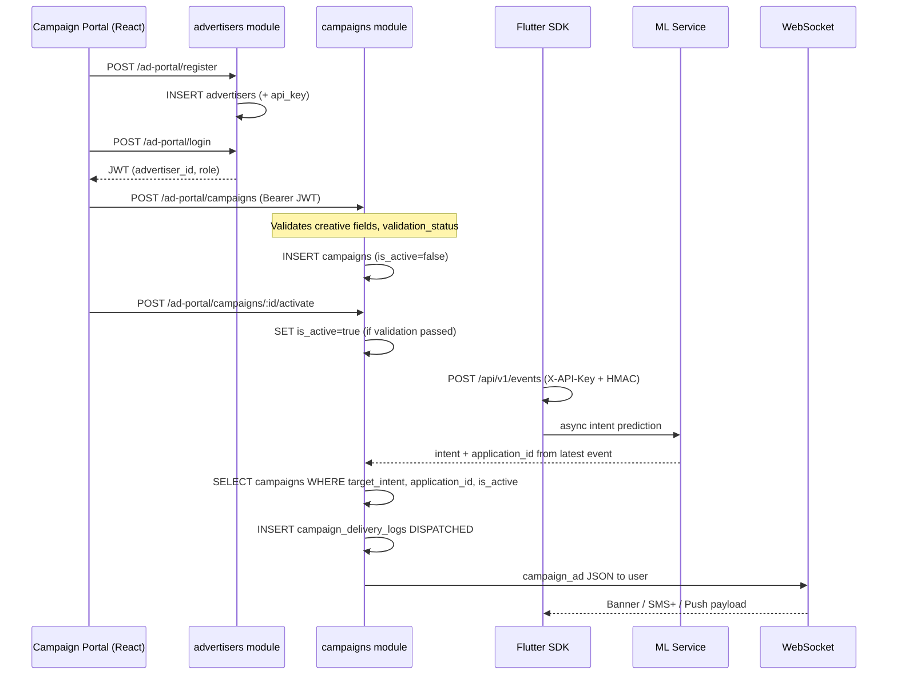

# Ad Portal & Campaign Delivery — Architecture

This document explains **why** the code is split into two modules and **how** data flows from advertiser signup to SDK ad display.

## Module layout (not mixed)

| Module | Responsibility | Database tables |
|--------|----------------|-----------------|
| **`internal/advertisers`** | Portal **identity**: register, login, JWT, roles, `api_key` | `advertisers` |
| **`internal/campaigns`** | **Campaign CRUD**, validation, activation, ad matching, delivery logs, WebSocket push | `campaigns`, `campaign_delivery_logs` |

HTTP routes are mounted together under `/api/v1/ad-portal` for convenience, but **packages stay separate** so frontend auth and campaign features can evolve independently.

```
internal/advertisers/          internal/campaigns/
├── domain/roles.go            ├── model/campaign.go
├── model/advertiser.go        ├── model/delivery_log.go
├── application/auth_service   ├── application/campaign_service.go
├── infrastructure/repo        ├── application/ad_delivery_service.go
└── interfaces/http/auth_*     ├── application/validator.go
                               ├── infrastructure/repo
                               ├── events/ + consumers/
                               └── interfaces/http/handler.go
```

Earlier MVP code lived only under `advertisers/` (including `portal_users`, `creatives` table). That is **replaced** by your SQL schema and this split.

## Database migration

Run: `internal/platform/database/migrations/20260603120000_advertisers_campaigns.sql`

- **`advertisers`** — company, email, password, `api_key`, plus portal fields `role`, `contact_name`, `is_active`
- **`campaigns`** — one row = one ad unit (creative fields embedded: `title`, `body_text`, `image_url`, `destination_url`, `canvas_json`, `creative_format`, budgets, `is_active`)
- **`campaign_delivery_logs`** — `DISPATCHED`, `RENDERED`, `CLICKED`, `CONVERTED`

GORM `AutoMigrate` on startup also aligns models if you skip manual SQL (fresh dev). For production, prefer applying the SQL migration.

## End-to-end flow



### 1. Advertiser auth (`advertisers` module)

- Register → row in **`advertisers`**
- Login → JWT with `advertiser_id` + `role` (`advertiser`, `read_only_analyst`, `operator_admin`)
- Roles enforced in middleware (`internal/platform/middleware/ad_portal_auth.go`) using `advertisers/domain/roles.go`

### 2. Campaign creation (`campaigns` module)

- **`POST /ad-portal/campaigns`** creates one row with:
  - `target_intent` — must match ML intent (e.g. `crypto_interest`)
  - `application_id` — SDK app UUID from developer portal (which host app shows the ad)
  - `creative_format` — `BANNER` | `PUSH_PLUS` | `SMS_PLUS`
  - Creative columns + `destination_url` (required)
- Validator sets `validation_status` (`passed` / `warning` / `failed`)
- **`POST /ad-portal/campaigns/:id/activate`** sets `is_active = true` only if validation passed

There is **no separate `creatives` table** in your schema — creative content is columns on `campaigns`.

### 3. SDK ingest & intent (`/api/v1` — separate API)

- Events stored with `application_id` from the authenticated SDK key
- Prediction runs (sync or async via Redis/bus)
- `AdDeliveryService` (in **campaigns** module) finds:
  - `target_intent` = predicted intent
  - `application_id` = from user’s latest event
  - `is_active = true` and `validation_status = passed`
- Tries formats in order: BANNER → SMS_PLUS → PUSH_PLUS

### 4. Delivery

- Publishes `campaign.ad.delivered` → WebSocket consumer sends `type: "campaign_ad"` to `user_id`
- Logs **`campaign_delivery_logs`** with status `DISPATCHED`

## API surface (ad portal)

| Method | Path | Module |
|--------|------|--------|
| POST | `/ad-portal/register` | advertisers |
| POST | `/ad-portal/login` | advertisers |
| GET | `/ad-portal/me` | advertisers |
| POST | `/ad-portal/admin/users` | advertisers |
| POST/GET | `/ad-portal/campaigns` | campaigns |
| GET | `/ad-portal/campaigns/:id` | campaigns |
| POST | `/ad-portal/campaigns/:id/activate` | campaigns |
| GET | `/ad-portal/campaigns/:id/preview` | campaigns |

SDK remains under `/api/v1` with **API key + HMAC** (not advertiser JWT).

## Create campaign example

```json
{
  "name": "Crypto Banner Q2",
  "target_intent": "crypto_interest",
  "application_id": "YOUR-FLUTTER-APP-UUID",
  "creative_format": "BANNER",
  "title": "Trade smarter",
  "body_text": "Zero fees this week",
  "image_url": "https://cdn.example.com/banner.png",
  "destination_url": "https://example.com/promo",
  "canvas_json": {},
  "daily_budget_cap": 50,
  "total_budget_cap": 500
}
```

Get `application_id` from **Developer Portal** → create application → use the returned application UUID when building the campaign.
