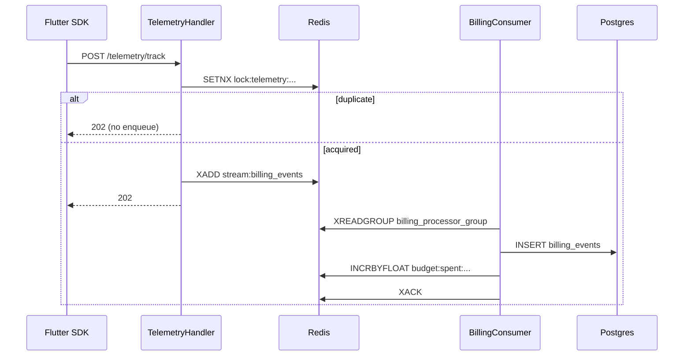
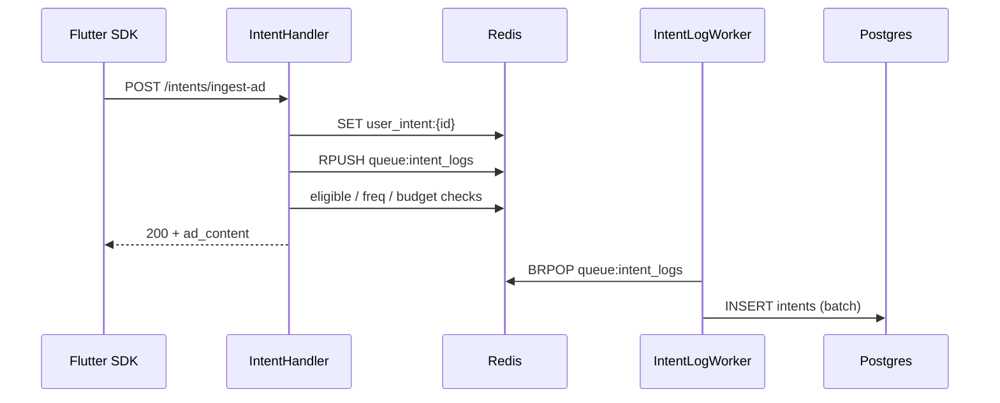
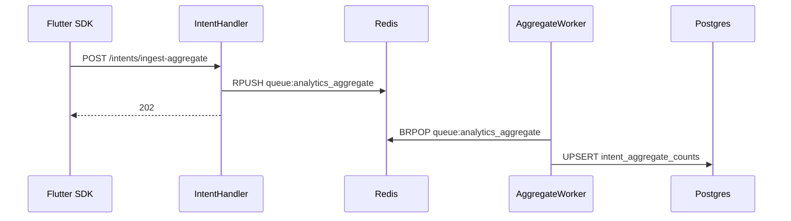

# SDK ingest pipelines: telemetry, ingest-ad, ingest-aggregate

How the three Flutter-facing write paths are wired: HTTP handlers → Redis → background workers → Postgres.

**Base path:** `/api/v1`  
**Auth (all three):** `SDKAuthMiddleware` — `X-API-Key` + HMAC `X-Signature` over the raw body (Swagger uses `X-SDK-Secret` only to compute the signature).

```
cmd/api/main.go
  ├─ route.InitRouter(...)                      # mounts /api/v1 + SDK auth
  ├─ bootstrap.StartIntentLogWorker(...)        # BRPOP queue:intent_logs
  ├─ bootstrap.StartAnalyticsAggregateWorker(...) # BRPOP queue:analytics_aggregate
  └─ bootstrap.StartBillingStreamWorker(...)    # XREADGROUP stream:billing_events
```

---

## Quick comparison

| Endpoint | Sync response | Redis | Background job | Postgres |
|----------|---------------|-------|----------------|----------|
| `POST /telemetry/track` | **202** (also on dedup) | SETNX lock + XADD stream | Billing stream consumer | `billing_events` + `campaign_delivery_logs` + `delivery_jobs` (+ budget keys) |
| `POST /intents/ingest-ad` | **200** + ad creative | SET intent, RPUSH logs, campaign cache/freq | Intent log worker | `intents` + `campaign_delivery_logs` (DISPATCHED) + `delivery_jobs` |
| `POST /intents/ingest-aggregate` | **202** | RPUSH aggregate queue | Aggregate worker | `intent_aggregate_counts` upsert |

> **Important:** Telemetry only persists when `campaign_id` exists in `campaigns` and the advertiser has an active subscription + billing rates. Swagger example UUIDs (`550e8400-…`) are placeholders — using them returns **202** but the worker **skips** the message (still ACKs). Check backend logs for `billing consumer: skip message`.
>
> **`delivery_jobs` is not seeded.** Docker rebuild keeps the Postgres volume (`postgres_data`), so truncating that table is permanent until new rows are written by ingest-ad / telemetry. There is no seed script that repopulates it.

---

## Shared pieces

### Auth

| Piece | Path |
|-------|------|
| Middleware | `internal/platform/middleware/auth.go` → `SDKAuthMiddleware` |
| Registration | `internal/auth/routes/auth_route.go` → returned middleware |
| Applied on | `internal/platform/route/router.go` — entire `/api/v1` group |
| API key lookup | hashed `X-API-Key` → `api_keys` table |

Flow: verify publishable key → for POST, verify `X-Signature = hex(HMAC-SHA256(secret, body))` → set `application_id` on context.

### Redis client

All Redis ops go through `internal/platform/redis/redis.go` (`RedisClient`):  
`SetNX`, `Set`, `Get`, `Incr`, `IncrByFloat`, `Expire`, `Exists`, `RPush`, `BRPop`, `XAdd`, `XGroupCreateMkStream`, `XReadGroup`, `XAck`.

### Folder map (modules involved)

```
internal/
├── platform/
│   ├── route/router.go              # InitRouter — wires everything
│   ├── middleware/auth.go           # SDKAuthMiddleware
│   ├── redis/redis.go               # Redis helpers
│   └── bootstrap/
│       ├── delivery_sdk.go          # telemetry handler + billing worker start
│       ├── intents.go               # ingest-ad/aggregate handler + intent-log worker
│       └── analytics.go             # aggregate worker start
├── delivery/http/
│   ├── telemetry_handler.go         # POST /telemetry/track
│   └── routes.go                    # RegisterSDKRoutes
├── billing/
│   ├── worker/billing_consumer.go   # stream consumer
│   └── infrastructure/
│       ├── billing_event_repository.go
│       └── persistence/billing_event_row.go
├── intents/
│   ├── interfaces/http/
│   │   ├── handler.go               # IngestIntentAd, IngestIntentAggregate
│   │   ├── dto.go
│   │   └── routes.go
│   ├── application/service.go       # IngestAndFetchAd
│   ├── validator/validate.go
│   ├── domain/
│   └── infrastructure/
│       ├── profile_repository.go
│       ├── intent_log_queue.go      # queue:intent_logs
│       ├── intent_log_worker.go
│       ├── redis_repository.go      # user_intent: cache
│       ├── intent_cache_adapter.go
│       ├── aggregate_repository.go  # upsert intent_aggregate_counts
│       └── persistence/
│           ├── intent_row.go
│           └── aggregate_row.go
├── analytics/
│   ├── application/aggregate_ingest.go
│   ├── domain/aggregate_report.go
│   └── infrastructure/
│       ├── aggregate_queue.go       # queue:analytics_aggregate
│       └── aggregate_worker.go
└── campaigns/
    ├── application/intent_ad_selector.go
    └── infrastructure/redis_repository.go   # eligible cache, freq, budget filter
```

---

## 1. `POST /api/v1/telemetry/track`

**Tag:** `SDK - Bill Track`  
**Purpose:** High-volume consented impression/click/… ingest with spam dedup, then async billing write-behind.

### Request

```json
{
  "campaign_id": "550e8400-e29b-41d4-a716-446655440000",
  "event_type": "impression",
  "pseudonymous_id": "9b1deb4d-3b7d-4bad-9bdd-2b0d7b3dcb6d",
  "transaction_value": 0,
  "occurred_at": "2026-07-18T12:00:00Z"
}
```

| Field | Rules |
|-------|--------|
| `campaign_id` | required UUID |
| `event_type` | `impression` \| `click` \| `install` \| `signup` \| `purchase` |
| `pseudonymous_id` | UUID; **required** for impression/click (dedup key) |
| `transaction_value` | optional ≥ 0 |
| `occurred_at` | optional RFC3339; defaults to server UTC now |

### HTTP path (sync)

```
SDKAuthMiddleware
  → TelemetryHandler.Track          # internal/delivery/http/telemetry_handler.go
      1) validate event_type
      2) impression/click → SETNX lock (see Redis)
         - already locked → 202, exit (no stream write)
      3) XADD stream:billing_events
      4) 202 Accepted
```

**Wiring:** `bootstrap.NewDeliverySDKSystem` → `NewTelemetryHandler` → `deliveryHTTP.RegisterSDKRoutes`.

### Redis (handler)

| Key | Op | TTL / notes |
|-----|-----|-------------|
| `lock:telemetry:{pseudonymous_id}:{campaign_id}:{event_type}` | **SETNX** value `"1"` | impression **5m**, click **1h** |
| `stream:billing_events` | **XADD** (approx maxLen **100000**) | fields: `campaign_id`, `event_type`, `transaction_value`, `occurred_at`, optional `pseudonymous_id` |

`install` / `signup` / `purchase` skip the SETNX gate and go straight to XADD.

### Background job: billing stream consumer

**Started in:** `main` → `bootstrap.StartBillingStreamWorker` → `billing/worker.StartBillingConsumer`

| Setting | Value |
|---------|--------|
| Stream | `stream:billing_events` |
| Consumer group | `billing_processor_group` |
| Consumer name | `billing-worker-1` |
| Batch | up to **100** messages |
| Block | ~2s on new messages (`>`); also drains pending (`0`) |

**Per batch:**

1. Parse stream fields  
2. Load campaign + active subscription + billing rates  
3. Compute charge → `BillingEventRepository.CreateBatch` → table **`billing_events`**  
4. `INCRBYFLOAT budget:spent:{campaign_id}:{YYYY-MM-DD}` + **EXPIRE 48h**  
5. If daily/total cap exceeded → `SET budget_exhausted:{campaign_id}` (no TTL)  
6. **XACK** processed IDs  

### Postgres (worker)

| Table | Role |
|-------|------|
| `billing_events` | insert batch |
| `campaigns` | read caps / advertiser / billing model |
| `advertiser_subscriptions` | read active plan |
| `billing_rates` | read rates |

### Files

- `internal/delivery/http/telemetry_handler.go`
- `internal/delivery/http/routes.go`
- `internal/platform/bootstrap/delivery_sdk.go`
- `internal/billing/worker/billing_consumer.go`
- `internal/billing/infrastructure/billing_event_repository.go`
- `internal/billing/infrastructure/persistence/billing_event_row.go`
- `internal/platform/redis/redis.go`

---

## 2. `POST /api/v1/intents/ingest-ad`

**Tag:** `SDK - Intents`  
**Purpose:** Accept an on-device ML intent, persist asynchronously, rank a campaign, return creative **synchronously**.

### Request / response

```json
{
  "pseudonymous_id": "user_or_pseudo_id",
  "intent_name": "shopping_interest",
  "confidence": 0.91,
  "model_version": "2.0.0",
  "channel_code": "IN_APP_BANNER"
}
```

| Field | Rules |
|-------|--------|
| `pseudonymous_id` | required |
| `intent_name` | required |
| `confidence` | required, domain 0.0–1.0 |
| `model_version` | optional |
| `channel_code` | optional; empty tries `IN_APP_BANNER`, `SMS_PLUS`, `PUSH`, `NATIVE_FEED` |

**200 response:** profile echo + `campaign_id`, `campaign_name`, `channel_code`, `ad_content`.  
**404** if no eligible campaign.

### HTTP path (sync)

```
SDKAuthMiddleware
  → Handler.IngestIntentAd                    # intents/interfaces/http/handler.go
    → IntentService.IngestAndFetchAd          # intents/application/service.go
        → ValidateIntentProfile
        → CacheActiveIntent                   # Redis SET user_intent:{id}
        → ProfileRepository.Save
            → IntentLogQueue.Enqueue          # RPUSH queue:intent_logs
              (or sync DB insert if Redis down)
        → IntentAdSelector.SelectAd
            → CachedCampaignRepository.SelectBestCampaign
                - eligible list cache
                - drop budget_exhausted
                - frequency cap
                - rank by subscription plan tier (monthly fee DESC)
                - INCR freq on winner
```

**Wiring:** `bootstrap.NewIntentSystem` → `intentHTTP.NewHandler` → `RegisterRoutes`.

### Redis (handler + ad select)

| Key | Op | TTL / notes |
|-----|-----|-------------|
| `user_intent:{pseudonymous_id}` | **SET** (intent name) | **30m** |
| `queue:intent_logs` | **RPUSH** JSON profile | consumed by worker |
| `eligible_campaigns:{intent}:{channel}` (or `:all`) | **GET** / **SET** JSON list | **5m** |
| `budget_exhausted:{campaign_id}` | **EXISTS** | skip campaign if set |
| `freq:{pseudonymous_id}:{campaign_id}` | **GET** / **INCR** + **EXPIRE** | **24h**; default cap ~3/day |

### Background job: intent log worker

**Started in:** `main` → `bootstrap.StartIntentLogWorker` → `intents/infrastructure.StartIntentLogWorker`

| Setting | Value |
|---------|--------|
| Queue | `queue:intent_logs` |
| Pop | **BRPOP** timeout ~2s |
| Flush | when batch ≥ **50** **or** ≥ **3s** since last flush |
| Write | `IntentRepository.CreateBatch` → table **`intents`** |

Payload fields typically: `user_id` (= pseudonymous id), `intent_name`, `confidence`, `model_version`, `created_at`.

### Postgres

| Table | Role |
|-------|------|
| `intents` | async batch insert |
| `campaigns` (+ subscription/plan joins) | read for eligibility / ranking |

### Files

- `internal/intents/interfaces/http/{handler,dto,routes}.go`
- `internal/intents/application/service.go`
- `internal/intents/validator/validate.go`
- `internal/intents/infrastructure/profile_repository.go`
- `internal/intents/infrastructure/intent_log_queue.go`
- `internal/intents/infrastructure/intent_log_worker.go`
- `internal/intents/infrastructure/redis_repository.go`
- `internal/intents/infrastructure/intent_cache_adapter.go`
- `internal/intents/infrastructure/persistence/intent_row.go`
- `internal/campaigns/application/intent_ad_selector.go`
- `internal/campaigns/infrastructure/redis_repository.go`
- `internal/platform/bootstrap/intents.go`

---

## 3. `POST /api/v1/intents/ingest-aggregate`

**Tag:** `SDK - Intents`  
**Purpose:** Anonymous / non-consented rollups — **no ads**, counters only.

### Request

```json
{
  "date_bucket": "2026-07-22",
  "intents": [
    { "intent_name": "shopping_interest", "count": 12, "days_consistent": 3 },
    { "intent_name": "fashion_interest", "count": 4, "days_consistent": 1 }
  ]
}
```

| Field | Rules |
|-------|--------|
| `date_bucket` | required `YYYY-MM-DD` |
| `intents` | required, min 1 |
| `intent_name` | required |
| `count` | required, min 1 → added to `signal_count` |
| `days_consistent` | required, min 1 → added to `weighted_count` |

**202** = queued. **503** if aggregate service / Redis unavailable.

### HTTP path (sync)

```
SDKAuthMiddleware
  → Handler.IngestIntentAggregate             # intents/interfaces/http/handler.go
    → AggregateIngestService.EnqueueReport    # analytics/application/aggregate_ingest.go
        → ValidateAggregateReport
        → normalize date_bucket to UTC midnight
        → AnalyticsAggregateQueue.Enqueue     # RPUSH queue:analytics_aggregate
        → 202
```

Same HTTP handler package as ingest-ad; aggregate service injected in `NewIntentSystem`.

### Redis

| Key | Op | Notes |
|-----|-----|--------|
| `queue:analytics_aggregate` | **RPUSH** (HTTP) / **BRPOP** (worker) | JSON `{ date_bucket, intents: [...] }` |

Plain Redis **list** (not a stream / consumer group).

### Background job: analytics aggregate worker

**Started in:** `main` → `bootstrap.StartAnalyticsAggregateWorker` → `analytics/infrastructure.StartAnalyticsAggregateWorker`

| Setting | Value |
|---------|--------|
| Queue | `queue:analytics_aggregate` |
| Pop | **BRPOP** ~2s |
| Processing | typically **one message** at a time |
| Write | `AggregateRepository.UpsertBatch` |

Upsert semantics on **`intent_aggregate_counts`**:

```sql
ON CONFLICT (intent_name, date_bucket) DO UPDATE
  signal_count   = signal_count   + EXCLUDED.signal_count,   -- += count
  weighted_count = weighted_count + EXCLUDED.weighted_count  -- += days_consistent
```

### Postgres

| Table | Role |
|-------|------|
| `intent_aggregate_counts` | upsert; unique `(intent_name, date_bucket)` |

### Files

- `internal/intents/interfaces/http/handler.go` (`IngestIntentAggregate`)
- `internal/intents/interfaces/http/dto.go`
- `internal/analytics/application/aggregate_ingest.go`
- `internal/analytics/domain/aggregate_report.go`
- `internal/analytics/infrastructure/aggregate_queue.go`
- `internal/analytics/infrastructure/aggregate_worker.go`
- `internal/intents/infrastructure/aggregate_repository.go`
- `internal/intents/infrastructure/persistence/aggregate_row.go`
- `internal/platform/bootstrap/analytics.go`
- `internal/platform/bootstrap/intents.go` (wires `aggregateIngest` into handler)

---

## End-to-end diagrams

### Telemetry



### Ingest-ad



### Ingest-aggregate



---

## Redis key cheat sheet

| Key pattern | Used by |
|-------------|---------|
| `lock:telemetry:{pseudo}:{campaign}:{event}` | telemetry dedup |
| `stream:billing_events` | telemetry enqueue + billing worker |
| `budget:spent:{campaign}:{date}` | billing worker |
| `budget_exhausted:{campaign}` | billing worker write; ingest-ad / delivery read |
| `user_intent:{pseudo}` | ingest-ad active intent cache |
| `queue:intent_logs` | ingest-ad → intent log worker |
| `eligible_campaigns:{intent}:{channel}` | campaign selection cache |
| `freq:{pseudo}:{campaign}` | frequency capping |
| `queue:analytics_aggregate` | ingest-aggregate → aggregate worker |

---

## Startup checklist

Workers only start if Redis is configured and reachable (`cfg.RedisAddr`). If Redis is down:

- **telemetry/track** — handler returns **503** (no publisher)
- **ingest-ad** — may fall back to sync Postgres intent insert; ad select degrades without cache
- **ingest-aggregate** — **503** (queue required)

Confirm in logs after boot:

- intent log worker listening on `queue:intent_logs`
- aggregate worker on `queue:analytics_aggregate`
- billing consumer group `billing_processor_group` on `stream:billing_events`
